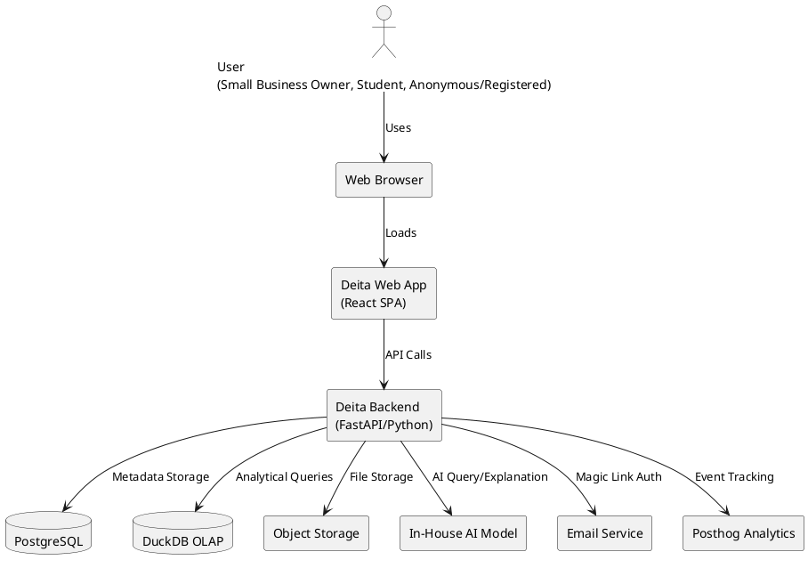

# Overall System Architecture

## Overview

Deita is a web-based platform for data exploration, SQL querying, and AI-powered assistance, targeting small business owners and students. The architecture is designed for simplicity, maintainability, and scalability, with a monolithic Python backend (FastAPI) and modular React frontend. Analytical queries are handled by DuckDB (OLAP).

## C4 Context Diagram (PlantUML)

## Key Components

- **Frontend (React SPA):** User interface for file upload, data exploration, SQL/AI interaction, workspace management.
- **Backend (FastAPI, Python):** Handles API requests, business logic, file processing, AI integration, authentication, analytics, and orchestrates DuckDB/PostgreSQL.
- **PostgreSQL Database:** Stores user, workspace, metadata, and query history.
- **DuckDB (OLAP):** In-process analytical database for fast SQL queries on uploaded data.
- **Object Storage (Abstraction):** Stores uploaded files; local for dev, S3-compatible for prod.
- **AI Model (In-House):** Provides SQL generation, explanations, and relationship suggestions.
- **Email Service:** Sends magic link authentication emails.
- **Analytics (Posthog):** Tracks user events and product metrics.

## Data Flow

1. User accesses Deita via browser.
2. Frontend interacts with backend via REST API.
3. Backend processes file uploads, stores files in object storage, and metadata in PostgreSQL.
4. DuckDB is used for fast, in-memory analytical queries on user data.
5. AI model is invoked for natural language queries and explanations.
6. Email service handles authentication flows.
7. Analytics events are sent to Posthog.

## Deployment

- Docker Compose for local and production deployments.
- Hosted on Hertzner cloud infrastructure.
- CI/CD via GitHub Actions.
