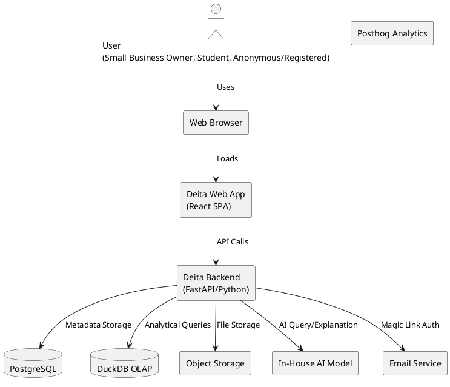

# Overall System Architecture

## Overview

Deita is a web-based platform for data exploration, SQL querying, and AI-powered assistance, targeting small business owners and students. The architecture is designed for simplicity, maintainability, and scalability, with a monolithic Python backend (FastAPI) and modular React frontend. Analytical queries are handled by DuckDB (OLAP), and the platform includes a persistent chat system for conversational AI interactions.

## C4 Context Diagram (PlantUML)

## Key Components

- **Frontend (React SPA):** User interface for file upload, data exploration, SQL/AI interaction, workspace management, and conversational AI chat.
- **Backend (FastAPI, Python):** Handles API requests, business logic, file processing, AI integration, authentication, chat message persistence, and orchestrates DuckDB/PostgreSQL.
- **PostgreSQL Database:** Stores user, workspace, file metadata, saved queries, and chat message history.
- **DuckDB (OLAP):** In-process analytical database for fast SQL queries on uploaded data.
- **Object Storage (S3-compatible):** Stores uploaded CSV files; MinIO in dev, S3-compatible in prod.
- **AI Model (LiteLLM/OpenRouter):** Provides SQL generation from natural language with chat memory context.
- **Email Service:** Sends magic link authentication emails (MailHog in dev).
- **Rate Limiting:** SlowAPI middleware for request rate limiting (100 req/min default per IP).

## Data Flow

1. User accesses Deita via browser.
2. Frontend interacts with backend via REST API (all endpoints under `/v1/`).
3. Backend processes file uploads, stores files in S3-compatible object storage, and metadata in PostgreSQL.
4. DuckDB is used for fast, in-memory analytical queries on user data.
5. AI model (via LiteLLM/OpenRouter) is invoked for natural language queries with chat memory context.
6. Chat messages are persisted in PostgreSQL for conversation continuity.
7. Email service handles magic link authentication flows.
8. Rate limiting protects API from abuse.

## Deployment

- Docker Compose for local and production deployments.
- Hosted on Hertzner cloud infrastructure.
- CI/CD via GitHub Actions.
