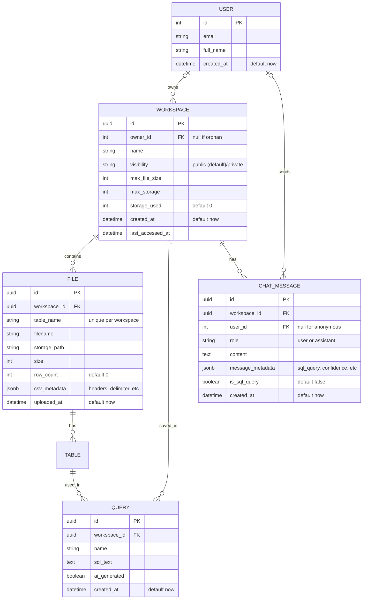

# Data Model Design

## Overview

The data model for Deita is designed to support flexible data exploration, workspace management, and AI-powered analytics. It leverages PostgreSQL for metadata and DuckDB for analytical queries on user-uploaded data.

## Entity Relationship Diagram (MermaidJS)

## Key Entities

- **User**: Authenticated users who can own workspaces. Email-based identification via magic links.
- **Workspace**: Collection of files, queries, and chat messages. Can be orphan (owner_id null) or owned (owner_id not null).
- **File**: Uploaded CSV file with metadata. Each file represents a table in DuckDB. Includes row count and CSV metadata (headers, delimiter).
- **Query**: SQL query saved for reuse. Can be user-written or AI-generated. Linked to workspace.
- **ChatMessage**: Conversational AI messages stored for context. Includes user prompts and assistant responses with metadata.

## Implementation Notes

### File Management

- Files are stored in S3-compatible object storage (MinIO for dev, S3 for prod)
- Each file has a unique `table_name` that's used in SQL queries
- CSV metadata includes headers and parsing information
- Row count is tracked for quick reference

### Chat System

- Messages are workspace-scoped and ordered by creation time
- Supports anonymous users (user_id can be null)
- Message metadata stores AI response details (SQL queries, confidence scores)
- `is_sql_query` flag marks messages containing executable SQL
- Chat history is used to provide context to AI model

### Workspace Types

- **Orphan**: No owner, 50MB file limit, 100MB total storage
- **Owned**: Has authenticated owner, 200MB file limit, 200MB total storage

## DuckDB Usage

- Each workspace's uploaded files are loaded into DuckDB for fast, in-memory analytical queries.
- Files are loaded from S3-compatible storage on-demand during query execution.
- Table schemas and row counts are stored in PostgreSQL for metadata and quick lookup.
- Queries are validated to ensure only SELECT and WITH statements are executed.
- Default page size is 50 rows, configurable via query parameters.
- Query timeout is enforced at 30 seconds to prevent long-running queries.

## Relationships & Constraints

- Orphan workspaces have no owner (owner_id is null).
- Only SELECT and WITH queries are allowed (enforced at backend).
- File size and workspace limits enforced at upload.
- Chat messages cascade delete with workspace deletion.
- Files cascade delete with workspace deletion.
- Queries cascade delete with workspace deletion.

## Extensibility

- Model supports future features: query sharing, export history, AI relationship suggestions.
- Chat system enables conversational AI features and query refinement.
- Message metadata allows for rich AI response data storage.
