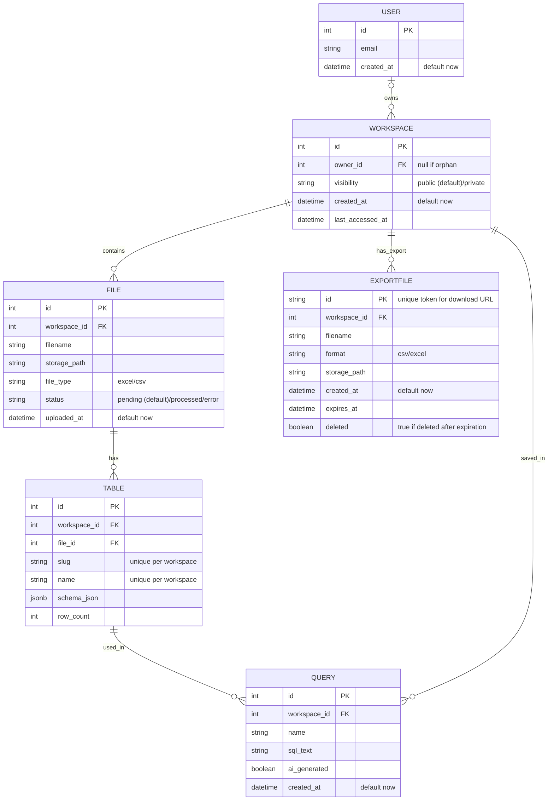

# Data Model Design

## Overview
The data model for Deita is designed to support flexible data exploration, workspace management, and AI-powered analytics. It leverages PostgreSQL for metadata and DuckDB for analytical queries on user-uploaded data.

## Entity Relationship Diagram (MermaidJS)

## Key Entities

- **User**: Owns workspaces and queries.
- **Workspace**: Collection of files, tables, and queries. Can be orphan (owner_id null) or owned (owner_id not null).
- **File**: Uploaded Excel/CSV file, linked to a workspace.
- **Table**: Logical table (Excel tab or CSV), linked to a file.
- **Query**: SQL query, can be user-written or AI-generated, linked to workspace.

## DuckDB Usage
- Each workspace's uploaded files are loaded into DuckDB for fast, in-memory analytical queries.
- Table schemas and row counts are stored in PostgreSQL for metadata and quick lookup.

## Relationships & Constraints
- Orphan workspaces have no owner (owner_id is null).
- Only SELECT queries are allowed (enforced at backend).
- File size and workspace limits enforced at upload.
- Automatic deletion of unused workspaces/files per PRD.

## Extensibility
- Model supports future features: query sharing, export history, AI relationship suggestions.
