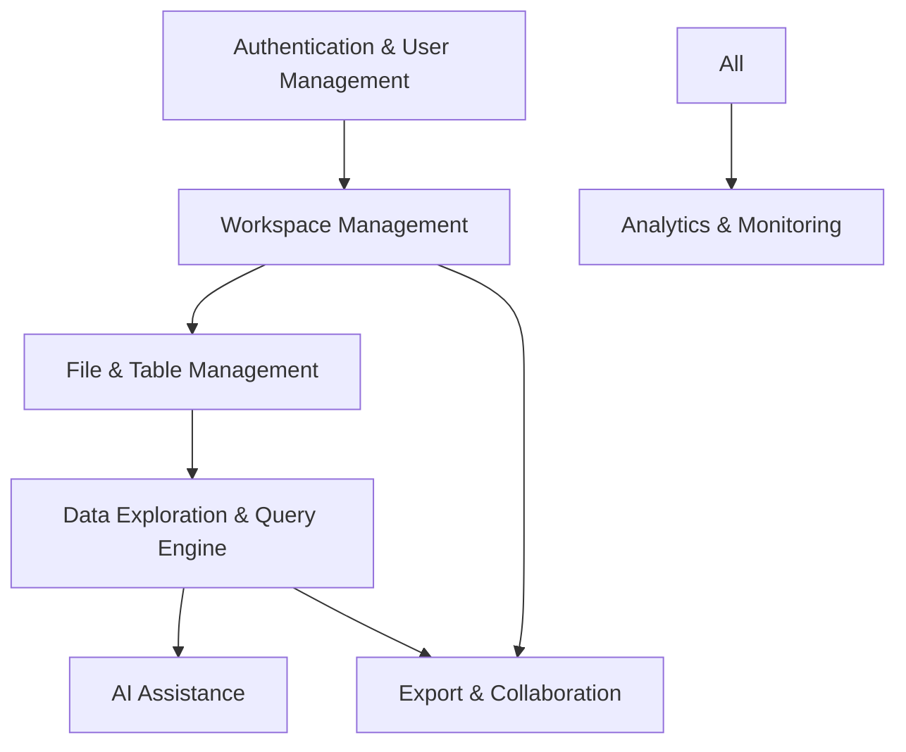

# Service Boundaries

## Overview
Deita uses a monolithic backend (FastAPI/Python) for simplicity, but logical service boundaries are defined to ensure maintainability, scalability, and future extensibility. Each boundary represents a distinct domain of responsibility within the system.

## Logical Service Boundaries

### 1. Authentication & User Management
- Magic link email authentication
- User session management
- Anonymous/registered user handling

### 2. Workspace Management
- Workspace creation, claiming, deletion
- Visibility (public/private) management
- Automatic workspace lifecycle (inactivity deletion)

### 3. File & Table Management
- File upload, storage abstraction (local/S3)
- Excel/CSV parsing
- Table creation, renaming, deletion
- Table metadata management

### 4. Data Exploration & Query Engine
- Table data browsing (pagination, filtering)
- SQL query execution (DuckDB, SELECT only)
- Query saving, renaming, deletion

### 5. AI Assistance
- Natural language to SQL generation
- Query result explanation
- Relationship/insight suggestion

### 6. Export & Collaboration
- Export query results (CSV/Excel)
- Workspace sharing via public link

### 7. Analytics & Monitoring
- Event tracking (Posthog)
- Usage metrics

## Boundary Diagram (MermaidJS)

## Rationale
- Clear boundaries enable modular code, easier testing, and future migration to microservices if needed.
- Each boundary can be mapped to a set of FastAPI routers/modules.

## Extensibility
- Boundaries support future features: advanced collaboration, audit logs, external integrations.
