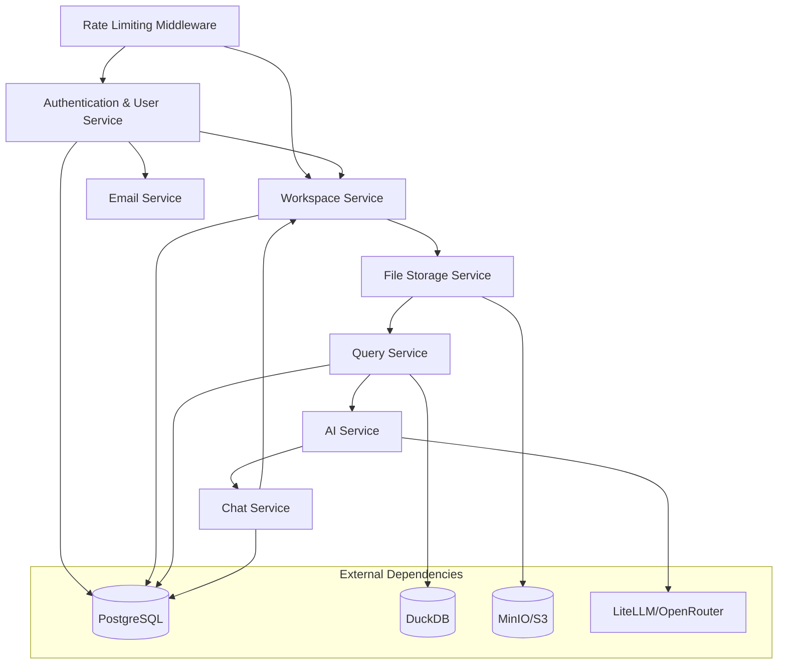

# Service Boundaries

## Overview

Deita uses a monolithic backend (FastAPI/Python) for simplicity, but logical service boundaries are defined to ensure maintainability, scalability, and future extensibility. Each boundary represents a distinct domain of responsibility within the system, implemented as separate service modules.

## Logical Service Boundaries

### 1. Authentication & User Management

**Module**: `app/services/auth_service.py`, `app/services/user_service.py`

- Magic link email authentication (generation and verification)
- JWT token creation and validation
- User session management
- Anonymous/registered user handling
- User CRUD operations

**API Routes**: `/v1/auth/magic-link`, `/v1/auth/verify`, `/v1/auth/me`

### 2. Workspace Management

**Module**: `app/services/workspace_service.py`

- Workspace creation, claiming, deletion
- Visibility (public/private) management
- Storage limit enforcement (50MB/100MB orphan, 200MB/200MB owned)
- Last accessed timestamp tracking
- Ownership verification

**API Routes**: `/v1/workspaces/` (CRUD), `/v1/workspaces/{id}/claim`

### 3. File & Storage Management

**Module**: `app/services/file_storage.py`

- File upload handling (multipart/form-data)
- S3-compatible storage abstraction (MinIO/S3)
- CSV parsing and validation
- File metadata management
- Row count tracking
- Storage quota enforcement

**API Routes**: `/v1/workspaces/{id}/files/` (CRUD)

### 4. Data Exploration & Query Engine

**Module**: `app/services/query_service.py`

- SQL query validation (SELECT/WITH only via sqlglot)
- DuckDB query execution
- Pagination support (50 rows default)
- Query timeout enforcement (30s default)
- CSV export with streaming
- Saved query management (CRUD)

**API Routes**:

- `/v1/workspaces/{id}/query` (execute)
- `/v1/workspaces/{id}/query/csv` (export)
- `/v1/workspaces/{id}/queries/` (saved queries CRUD)

### 5. AI Assistance

**Module**: `app/services/ai_service.py`

- Natural language to SQL generation
- Chat memory context management
- LiteLLM/OpenRouter integration
- Database schema description generation
- System prompt construction
- SQL query confidence tracking

**API Routes**: `/v1/workspaces/{id}/ai/query`

### 6. Chat System

**Module**: `app/services/chat_service.py`

- Chat message persistence (workspace-scoped)
- Message history retrieval with pagination
- Chat memory context building
- Message metadata management
- Chat clearing functionality

**API Routes**:

- `/v1/workspaces/{id}/chat/messages` (GET)
- `/v1/workspaces/{id}/chat/messages` (DELETE)

### 7. Email Service

**Module**: `app/services/email_service.py`

- Magic link email sending
- SMTP integration (MailHog in dev, production SMTP in prod)
- Email template management

**Used By**: Authentication service

### 8. Rate Limiting & Security

**Implementation**: SlowAPI middleware, FastAPI middleware stack

- Request rate limiting (100 req/min per IP default)
- CORS protection
- Trusted host validation
- Custom exception handling

**Applied Globally**: All API endpoints

## Service Interaction Diagram (MermaidJS)



## Service Implementation Details

### Dependency Injection

- Services are instantiated via FastAPI dependency injection (`Depends()`)
- Each service receives its dependencies (database session, settings, other services)
- Clean separation of concerns and testability

### Database Access

- **PostgreSQL**: Via SQLAlchemy ORM (user, workspace, file, query, chat_message models)
- **DuckDB**: Direct SQL execution for analytics
- **S3**: Via boto3 client for file storage

### Error Handling

- Custom exceptions: `WorkspaceNotFound`, `WorkspaceForbidden`, `BadRequestException`
- Global exception handlers convert to consistent JSON responses
- No sensitive information leaked in error messages

### Configuration

- All services use `Settings` from `app/core/config.py`
- Environment-based configuration via Pydantic Settings
- Secrets never hardcoded

## Boundary Enforcement

### Code Organization

```
app/
├── api/              # API route handlers (thin, delegate to services)
├── services/         # Business logic (thick, testable)
├── models/           # SQLAlchemy database models
├── schemas/          # Pydantic request/response schemas
├── core/             # Configuration, database, auth utilities
└── utils/            # Shared utility functions
```

### Testing Strategy

- **Unit tests**: Test services in isolation with mocked dependencies
- **Integration tests**: Test API endpoints with test database
- **Fixtures**: Shared test data via pytest fixtures

### Migration Path to Microservices

If needed, each service boundary can become a separate microservice:

1. Extract service module to separate project
2. Add API gateway for routing
3. Implement service-to-service communication (REST/gRPC)
4. Shared database → per-service databases

## Rationale

- **Clear boundaries**: Enable modular code, easier testing, and understanding
- **Single Responsibility**: Each service has one clear purpose
- **Dependency Management**: Services depend on abstractions, not implementations
- **Future-proof**: Easy migration to microservices if scaling requires it
- **Testability**: Services can be tested in isolation

## Extensibility

- Boundaries support future features:
  - Query sharing service
  - Advanced collaboration service
  - Audit logging service
  - Background job service (workspace cleanup)
  - Notification service
  - Advanced analytics service
