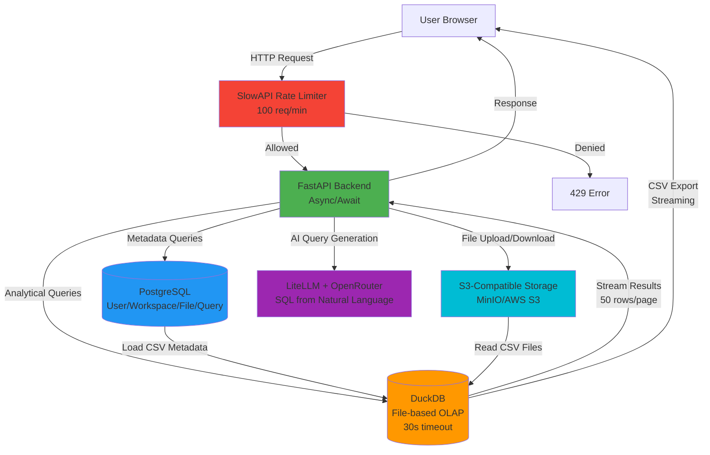

# Performance & Scalability

## Overview

Deita is designed for responsive user experience and efficient resource usage. The architecture leverages in-memory analytics (DuckDB), asynchronous Python (FastAPI), and object storage abstraction for optimal performance. Current implementation supports small teams (10-50 concurrent users) with clear scalability paths.

## Actual Performance Characteristics

### Query Execution

- **Default Timeout**: 30 seconds (configurable via `QUERY_TIMEOUT_SECONDS`)
- **Pagination**: 50 rows per page default (configurable: `page_size=1-1000`)
- **Query Engine**: DuckDB 0.9+ (in-process, file-based OLAP)
- **SQL Validation**: Pre-execution validation via sqlglot (only SELECT/WITH statements allowed)
- **CSV Export**: Streaming implementation for large result sets

### Rate Limiting

- **Default**: 100 requests per minute per IP address
- **Implementation**: SlowAPI middleware with Redis-like in-memory storage
- **Scope**: Applied to all API endpoints
- **Headers**: `X-RateLimit-Limit`, `X-RateLimit-Remaining`, `X-RateLimit-Reset`

### Storage Limits

- **Orphan Workspaces** (no owner):
  - Max file size: 50MB per file
  - Total storage: 100MB per workspace
- **Owned Workspaces** (authenticated user):
  - Max file size: 200MB per file
  - Total storage: 200MB per workspace
- **Format Support**: CSV (full), Excel (partial - needs verification)

### File Processing

- **Upload**: Synchronous processing (parses headers, detects types)
- **Validation**: File size, format, CSV delimiter detection
- **Metadata Extraction**: Row count, column count, CSV parsing info
- **Storage**: S3-compatible (MinIO dev, AWS S3 prod)

### Chat/AI Performance

- **AI Provider**: LiteLLM with OpenRouter integration
- **Context Window**: Recent chat messages + database schema
- **Message Persistence**: All messages stored in PostgreSQL
- **Response Time**: Depends on LLM provider (typically 2-10 seconds)

## Key Performance Strategies

### 1. Efficient Data Processing

- **DuckDB Advantages**: In-process OLAP engine, columnar storage, vectorized execution
- **Query Optimization**: Automatic query planning by DuckDB
- **Memory Management**: File-based DuckDB (shared volume at `/app/data/deita.duckdb`)
- **Pagination**: Server-side pagination with configurable page size
- **Streaming**: CSV export streams rows to prevent memory overflow

### 2. Asynchronous Backend (FastAPI)

- **Async Endpoints**: All I/O-bound operations (database, S3, AI) use async/await
- **Concurrency**: Uvicorn ASGI server with multiple workers
- **Connection Pooling**: SQLAlchemy async engine with connection pooling
- **File Operations**: Async boto3 for S3 uploads/downloads

**Not Yet Implemented:**

- Background task processing for long-running operations
- Async file parsing (currently synchronous)
- Query result caching

### 3. Resource Isolation

- **Workspace Isolation**: Each workspace has separate DuckDB tables
- **Database Isolation**: PostgreSQL for metadata, DuckDB for analytics
- **Storage Isolation**: Workspace-scoped S3 prefixes
- **User Isolation**: JWT-based authentication with workspace ownership checks

### 4. Caching & Indexing

**Currently Implemented:**

- PostgreSQL indexes on frequently queried columns (user.email, workspace.id, file.workspace_id)
- Table metadata stored in PostgreSQL (row_count, csv_metadata)

**Not Yet Implemented (Technical Debt):**

- Query result caching
- Table schema caching in memory
- Redis for distributed caching
- CDN for static assets

### 5. Horizontal Scalability

**Current State:**

- **Stateless Backend**: No in-memory session state, all state in PostgreSQL/S3
- **Load Balancing**: Not configured (single container in dev/prod)
- **Database**: Single PostgreSQL instance
- **Storage**: S3-compatible (horizontally scalable by nature)
- **DuckDB**: File-based, shared volume (not suitable for multi-instance)

**Scaling Limitations:**

- DuckDB file lock prevents multiple backend instances reading/writing simultaneously
- No distributed caching layer
- No message queue for background tasks

**Scaling Path:**

1. **Phase 1 (Current)**: Single backend container, shared DuckDB file
2. **Phase 2**: Multiple backend containers + per-workspace DuckDB files + Redis cache
3. **Phase 3**: Kubernetes + managed PostgreSQL + distributed DuckDB or ClickHouse

### 6. Monitoring & Metrics

**Currently Implemented:**

- **Logging**: Python logging with configurable levels
- **Health Check**: `/health` endpoint returns API status
- **Error Tracking**: FastAPI exception handlers with detailed error responses

**Not Yet Implemented (Technical Debt):**

- Posthog analytics integration (mentioned in PRD but not implemented)
- Query execution time tracking
- File upload success/failure metrics
- Resource usage monitoring (CPU, memory, storage)
- Alerting for slow queries or failed operations

## Performance Benchmarks

### Expected Performance (Single Instance)

- **File Upload**: 50MB file in ~5-10 seconds (depends on S3 latency)
- **Query Execution**: Simple SELECT on 100K rows in <1 second
- **Query Execution**: Complex JOIN on 100K rows in 1-5 seconds
- **CSV Export**: 100K rows streamed in ~10-20 seconds
- **AI Query Generation**: 2-10 seconds (depends on LLM provider)
- **Concurrent Users**: 10-50 users (with single backend instance)

### Bottlenecks & Mitigations

| Bottleneck         | Current Impact                    | Mitigation Strategy                                 | Status                |
| ------------------ | --------------------------------- | --------------------------------------------------- | --------------------- |
| Large file uploads | Blocks request during parsing     | Implement background task processing                | Not implemented       |
| DuckDB file lock   | Limits to single backend instance | Per-workspace DuckDB files or migrate to ClickHouse | Not implemented       |
| No query caching   | Repeated queries re-execute       | Implement Redis-based query result cache            | Not implemented       |
| AI latency         | 2-10s wait per query              | Use streaming responses, show progress              | Partially implemented |
| Storage I/O        | Slow S3 reads for large files     | Use CDN, implement file chunking                    | Not implemented       |
| No metrics         | Cannot identify slow queries      | Integrate Posthog or Prometheus                     | Not implemented       |

## Performance Diagram (MermaidJS)

## Scalability Roadmap

### Phase 1: Current (1-50 users)

- ✅ Single backend instance
- ✅ Single PostgreSQL instance
- ✅ S3-compatible storage
- ✅ File-based DuckDB
- ✅ Basic rate limiting
- ⚠️ No caching
- ⚠️ No metrics

### Phase 2: Small Team (50-500 users)

**Target:** Q2 2025 (if user growth demands)

- Add Redis for distributed caching
- Implement query result caching
- Per-workspace DuckDB files (enable multi-instance backend)
- Multiple backend containers with load balancer
- Implement background task processing (Celery + RabbitMQ)
- Add metrics and monitoring (Prometheus + Grafana)

### Phase 3: Medium Scale (500-5000 users)

**Target:** Q3-Q4 2025 (if user growth demands)

- Kubernetes orchestration
- Managed PostgreSQL (AWS RDS/Aurora)
- Redis Cluster for distributed cache
- CDN for static assets
- Database read replicas
- Consider migrating from DuckDB to ClickHouse for true multi-tenancy

### Phase 4: Enterprise (5000+ users)

**Target:** 2026+ (if needed)

- Multi-region deployment
- Dedicated database per large customer
- Advanced query optimization and cost management
- SLA guarantees and uptime monitoring
- Auto-scaling based on load

## Optimization Checklist

**Immediate (High Priority):**

- [ ] Implement query result caching (Redis)
- [ ] Add metrics and monitoring (Prometheus/Grafana or Posthog)
- [ ] Profile slow queries and add indexes
- [ ] Implement background task processing for file uploads
- [ ] Add query execution time tracking

**Short-term (Medium Priority):**

- [ ] Enable multiple backend instances (per-workspace DuckDB files)
- [ ] Implement CDN for static assets
- [ ] Add database connection pooling optimization
- [ ] Implement streaming AI responses
- [ ] Add file upload progress indicators

**Long-term (Low Priority):**

- [ ] Migrate to Kubernetes orchestration
- [ ] Implement database read replicas
- [ ] Evaluate ClickHouse for analytical workloads
- [ ] Add auto-scaling based on load
- [ ] Implement multi-region deployment

## Extensibility

- Ready for increased user load via container scaling (after DuckDB file lock resolved)
- Can migrate to cloud-native stack (Kubernetes) as user base grows
- Clear path from single instance → multiple instances → Kubernetes → multi-region
- Stateless backend design enables horizontal scaling with minimal refactoring
