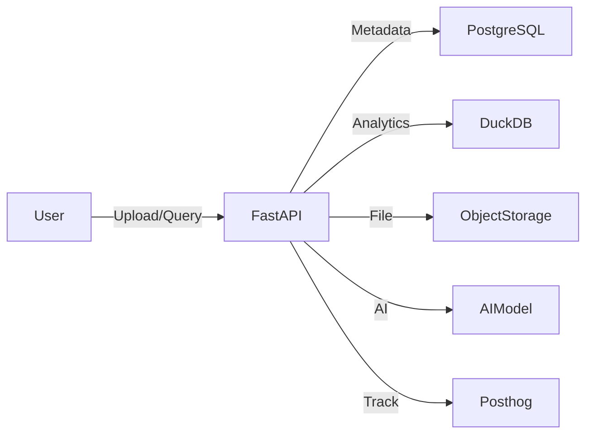

# Performance & Scalability

## Overview
Deita is designed for responsive user experience and efficient resource usage, supporting up to 10 concurrent users at launch, with a clear path to scale as needed. The architecture leverages in-memory analytics (DuckDB), asynchronous Python (FastAPI), and object storage abstraction for optimal performance.

## Key Strategies

### 1. Efficient Data Processing
- Use DuckDB for fast, in-process analytical queries on uploaded data
- Paginate and stream large table data to frontend
- Limit file size (50MB orphan, 200MB owned) to prevent resource exhaustion

### 2. Asynchronous Backend
- FastAPI enables async request handling for file uploads, queries, and AI calls
- Background tasks for file parsing, AI inference, and exports

### 3. Resource Isolation
- Each workspace operates in its own DuckDB context
- Object storage abstraction prevents local disk bottlenecks in production

### 4. Caching & Indexing
- Cache table schemas and query results for faster repeated access
- Index metadata in PostgreSQL for quick lookup

### 5. Horizontal Scalability
- Stateless backend enables scaling via Docker Compose (multiple containers)
- Object storage and PostgreSQL can be scaled independently
- Path to cloud-native scaling (Kubernetes) if needed

### 6. Monitoring & Metrics
- Track query execution time, file upload success, and resource usage via Posthog
- Alerting for slow queries or failed uploads

## Performance Diagram (MermaidJS)

## Bottlenecks & Mitigations
- **Large file uploads:** Enforced limits, background processing
- **Concurrent queries:** Async execution, workspace isolation
- **Storage IO:** Object storage for production, local for dev
- **AI latency:** In-house model, async inference

## Extensibility
- Ready for increased user load via container scaling
- Can migrate to cloud-native stack as user base grows
