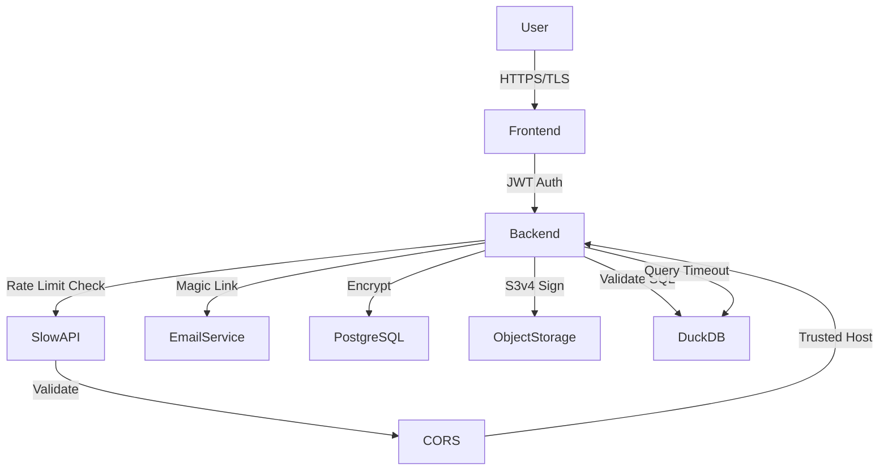

# Security

## Overview

Deita is designed to ensure user privacy, data protection, and secure access control. Security is embedded in every layer: authentication, data storage, transmission, rate limiting, and operational practices.

## Key Security Practices

### 1. Authentication & Authorization

- **Magic link email authentication** (no passwords stored)
- **JWT-based session management** (HS256 algorithm, 30-day token expiry default)
- **Role-based access**: Anonymous vs. registered users
- **Workspace ownership** enforced for sensitive actions (update, delete, claim)
- **User context tracking** for all authenticated operations

### 2. API Security & Rate Limiting

- **Rate limiting** via SlowAPI middleware (100 requests/minute per IP by default)
- **CORS protection** with configurable allowed origins
- **Trusted host middleware** to prevent host header attacks
- **SQL injection prevention** via sqlglot validation and parameterized queries
- **Query validation**: Only SELECT and WITH statements allowed
- **Query timeout enforcement** (30 seconds default)

### 3. Data Protection

- **Data encrypted at rest**: PostgreSQL database, S3-compatible object storage
- **Data encrypted in transit**: HTTPS/TLS for all connections
- **S3 signature v4** for secure object storage access
- **No sensitive data in logs** or error messages
- **Workspace isolation**: DuckDB context isolation per query
- **File validation**: MIME type and extension checking

### 4. File & Query Security

- **File type validation**: Only CSV files accepted (Excel support pending)
- **File size limits** enforced:
  - Orphan workspaces: 50MB per file, 100MB total
  - Owned workspaces: 200MB per file, 200MB total
- **Storage path isolation**: Files stored with unique workspace-scoped paths
- **Query safety**: Read-only queries via SELECT/WITH validation
- **SQL validation** with sqlglot library before execution

### 5. Input Validation & Sanitization

- **Pydantic models** for request/response validation
- **Email validation** via email-validator library
- **UUID validation** for workspace and resource IDs
- **SQL query validation** before execution
- **File content validation** via python-magic

### 6. Error Handling & Information Disclosure

- **Custom exception handlers** for consistent error responses
- **Sanitized error messages**: No stack traces or internal details exposed to clients
- **Structured error responses**: Consistent `{"error": "message"}` format
- **HTTP status codes**: Proper use of 400, 401, 403, 404, 500 codes

### 7. Secrets Management

- **Environment variables** for all secrets (never hardcoded)
- **Pydantic Settings** for configuration management
- **Default secrets flagged** for production override
- **Docker secrets support** for production deployments
- **S3 credentials** isolated per environment

### 8. Data Privacy & Compliance

- **GDPR considerations**: User consent, data minimization
- **User control**: Workspace deletion, file deletion
- **Anonymous usage**: Orphan workspaces don't require user identification
- **Data residency**: Hosted in EU (Hetzner Cloud)
- **Chat message privacy**: Workspace-scoped, deleteable by owner

### 9. Dependency Security

- **Regular dependency updates** via uv and npm
- **Minimal dependencies**: Focused dependency tree
- **Known vulnerability scanning** (planned: Dependabot, Snyk)
- **Ruff linting** for Python security issues

## Security Architecture Diagram (MermaidJS)

## Security Checklist

### Development

- [x] Environment-based configuration
- [x] Input validation on all endpoints
- [x] SQL injection prevention
- [x] Rate limiting implementation
- [x] CORS configuration
- [x] JWT token security
- [x] File upload validation
- [x] Query timeout enforcement

### Production Readiness

- [ ] Change default SECRET_KEY
- [ ] Configure proper CORS origins
- [ ] Configure trusted hosts
- [ ] Enable HTTPS/TLS
- [ ] Rotate S3 credentials
- [ ] Configure SMTP for production email
- [ ] Set up monitoring and alerting
- [ ] Implement automatic workspace deletion (planned)
- [ ] Add Dependabot for vulnerability scanning

## Known Security Considerations

1. **Workspace Auto-deletion**: Not yet implemented (PRD feature)
2. **Advanced audit logging**: Basic logging only, no comprehensive audit trail
3. **External identity providers**: Not implemented, magic link only
4. **File encryption at upload**: Files stored as-is in S3, not additionally encrypted
5. **Query result size limits**: Not enforced, potential for large memory usage
6. **IP-based rate limiting**: Could be bypassed with multiple IPs

## Extensibility

- Ready for future features: Audit logs, advanced role management, OAuth/OIDC providers, enhanced monitoring
