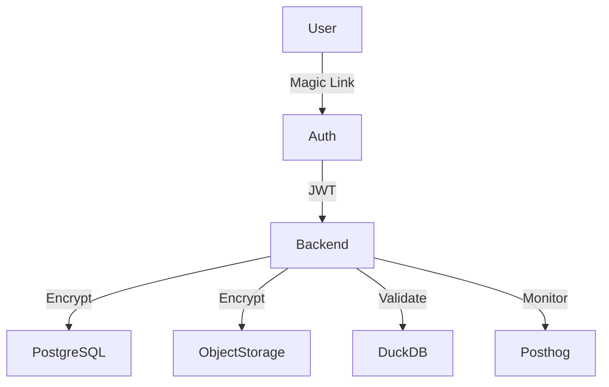

# Security

## Overview
Deita is designed to ensure user privacy, data protection, and compliance with GDPR and SOC2. Security is embedded in every layer: authentication, data storage, transmission, and operational practices.

## Key Security Practices

### 1. Authentication & Authorization
- Magic link email authentication (no passwords stored)
- JWT-based session management
- Role-based access: anonymous vs. registered users
- Workspace ownership enforced for sensitive actions

### 2. Data Protection
- Data encrypted at rest (PostgreSQL, object storage)
- Data encrypted in transit (HTTPS/TLS)
- No sensitive data in logs or analytics
- Automatic deletion of unused workspaces/files per PRD

### 3. File & Query Security
- Only Excel/CSV files accepted (MIME/type validation)
- File size limits enforced
- Only SELECT queries allowed (no data modification)
- SQL injection prevention via parameterized queries
- DuckDB context isolation per workspace

### 4. Compliance
- GDPR: user consent, right to deletion, data minimization
- SOC2: operational controls, auditability, incident response
- Data residency: hosted in EU (Hertzner)

### 5. Secrets Management
- Environment variables for secrets (never hardcoded)
- Docker secrets for production deployments

### 6. Monitoring & Incident Response
- Posthog for anomaly detection and usage monitoring
- Alerting for suspicious activity (e.g., abuse of public workspaces)
- Regular security reviews and dependency scanning

## Security Diagram (MermaidJS)

## Extensibility
- Ready for future features: audit logs, advanced role management, external identity providers
